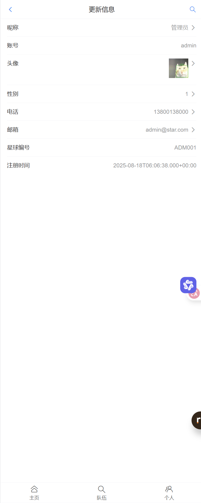

# Product Design Overview
---

## 📁 目录说明

| 文件夹 | 内容 |
|--------|------|
| [figma-lofi](./figma-lofi) | 低保真 |
| [prd](./prd)     | 需求文档、流程图 |
| [apifox](./apifox)     | API 接口设计 |
| [code](./code)     | 项目代码（前端、后端） |

---

## 使用指引

1. **原型查看**  
   打开 `figma-lofi` 文件夹，即可预览。

2. **需求阅读**  
   进入 `prd` 文件夹，按需打开对应文档。

---

## Figma 示例
主页

队伍页面

个人页面

详细信息前往[figma-lofi](./figma-lofi)查看。

## API 设计
API总体设计

## 项目成果
主页

队伍

更新个人主页
